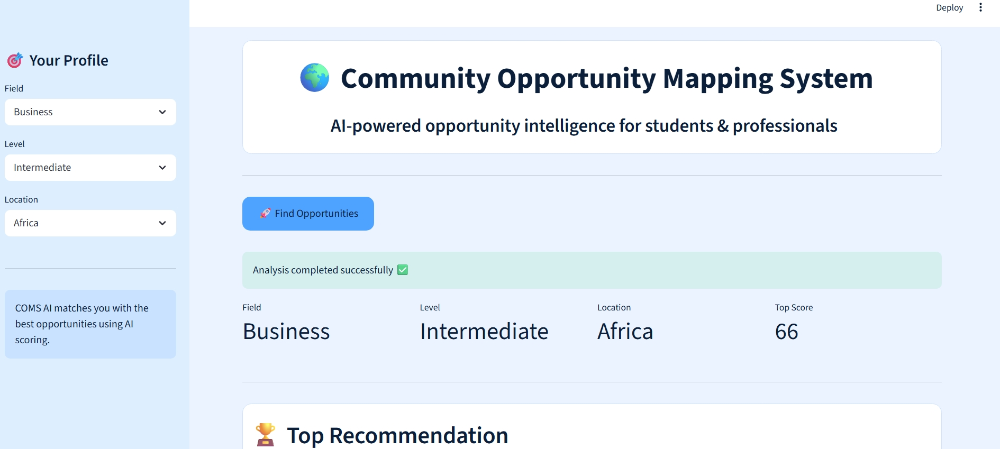

# 🌍 COMS AI - Community Opportunity Mapping System

## 📌 Live App
👉 https://coms-ai-fadil-ade.streamlit.app/

---

## 📸 App Preview

---

## 🧠 About the Project

**COMS AI (Community Opportunity Mapping System)** is an AI-powered platform that helps users discover, analyze, and evaluate opportunities based on their:

- Field of interest (Tech, Business, Social, Policy)
- Skill level (Beginner → Advanced)
- Location (Local, Africa, Global, Remote)

It uses an intelligent scoring system to rank opportunities and generate personalized recommendations.

---

## 🚀 Key Features

### 🧠 AI Opportunity Matching
Automatically matches users with relevant opportunities.

### 🏆 Smart Ranking System
Scores each opportunity using:
- Skill alignment
- Accessibility
- Geographic relevance
- Progression potential

### 📊 Committee-Level Evaluation
Simulates real selection logic like scholarship committees.

### 📍 Local & Global Mapping
Visualizes opportunities across different regions.

### 📄 AI Impact Report Generator
Generates downloadable PDF reports using ReportLab.

### 🏆 Leadership Narrative Generator
Creates a personalized summary for users.

---

## 🛠️ Tech Stack

- Python
- Streamlit
- Pandas
- ReportLab
- Folium (map visualization)
- Streamlit PDF Viewer

---

## 📂 Project Structure
